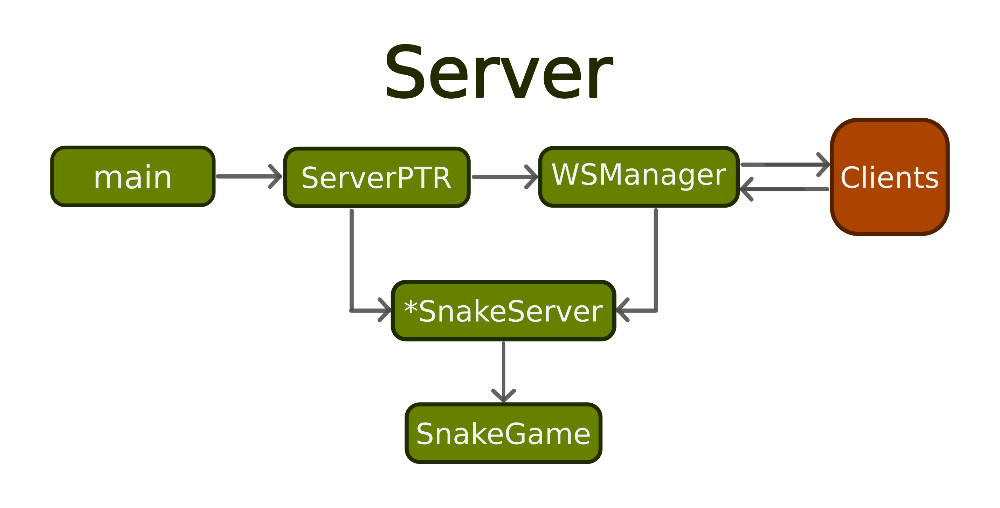

# Online 2 Player Snake 
## Server
### Author: Tyler Black

The server program for 2 player snake game ([client repo found here](https://github.com/khakis23/SnakeGameClient)).
SnakeServer is a lightweight websocket server that hosts a 2 player snake
match.

The server is a stateful authoritative server that is tick-less. The client sends all
updates to the server, and the server handles all logic. However, the client does hold the
tick state, and the overall game state. Since snake is a low tick and simple
game, there is no tick verification or latency prediction.

## Architecture

By binding to $0.0.0.0:9001$, the server accepts connections on all network 
interfaces. This allows multiple server deployments, and each server 
instance is capable of hosting many simultaneous games.



## Message Protocol

Messages are sent as JSON `code` and `payload` pairs. All server-client
communication is handled by one of these messages. 

NOTES: 
- Payloads are sent as strings, and coordinates are sent as `x,y` pairs,
with no spaces.
- NULL payloads do not matter—usually sent as 0.

### **To Client**

| Code          | Payload   | Description                                                 |
|---------------|-----------|-------------------------------------------------------------|
| **SEAT**         | —         | —                                                           |
| **START**        | `player`  | Both users connected, start app (before set, first message) |
| **COLLISION**    | `player`  | Snake collided                                              |
| **APPLE**        | `x,y`     | Sends new apple coordinates                                 |
| **GROW**         | `player`  | Tells client that a `player` should grow                    |
| **SCORE**        | `s1,s2`   | Sends updated scores for both players                       |
| **SET**          | —         | Both players ready, start game                              |
| **DISCONNECT**   | `player`  | Notifies that a `player` disconnected                       |


### **Both Directions**

| Code        | Payload | Description                                   |
|-------------|----------|-----------------------------------------------|
| **MOVE**       | `x,y`    | Movement update (player → server, server → client) |


### **To Server**

| Code        | Payload | Description                         |
|-------------|----------|-------------------------------------|
| **READY**      | —        | Client indicates it is ready to start game |
| **RESET**      | —        | Client requests a full game reset |   |


## Build

The server is built using cmake and uses a single dependency.

### Prerequisites
- [vcpkg](https://github.com/microsoft/vcpkg) to install `unofficial-uwebsockets` (v20.74.0)
  - (alternate option) install manually [$\mu$websockets](https://github.com/uNetworking/uWebSockets)
    - **must** change include_directories and link_libraries in **CMakeLists.txt**
- CMake >3.31
- C++23 Compiler
- MacOS or Linux 
  - (Windows should work, but untested)


1. Install prerequisites
2. Generate build using CMake (be sure to set your paths in the script below):
```bash 
    mkdir -p build
    cd build

    cmake .. \
    -DCMAKE_BUILD_TYPE=Release \
    -DCMAKE_TOOLCHAIN_FILE=/path/to/vcpkg/scripts/buildsystems/vcpkg.cmake
```
3. Compile: 
```bash 
  cmake --build . -j$
```
4. Run:
```bash 
  ./SnakeServer
```
